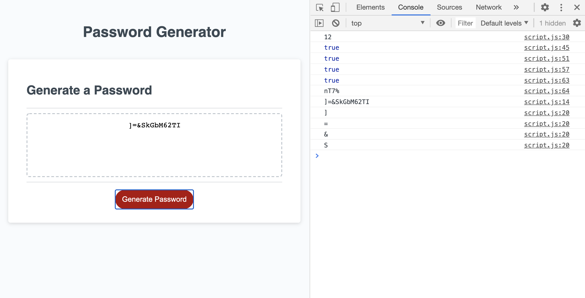

# passwordgenerator
This assignment is still really hard for me.  I was able to get my code to generate a random password, but I still don't completely understand how it all works.  I need to spend more time seeing what is connected to what, what calls what, etc.  I spent many hours going through w3schools Javascript tutorial, watching YouTube videos, collaborating with my group and other classmates, and met with my tutor.  I'm hoping as class keeps going and with more practice it will start to make more sense and click for me. I need this to be implanted in my brain: generateBtn.addEventListener("click", understandJavaScript).  And then I need that button pressed!!  
## Var
At first I found a YouTube video that had a link to a website that all random characters came from.  I got it to work but I didn't like it for now because I wanted it more basic so I could have a better understanding.  So I created variables for all the characters and then put them into strings.  When I met with my tutor she told me a way I can put them into arrays.  I have a comment in my JavaScript code that tells me what I need to do for that to happen.  I'll do that later.  I'm still trying to keep it simple and basic for better understanding.  
## Function
Initially I had 4 or 5 different functions.  After collaborating with my group I discovered I could do it all with two functions.  I had a lot of repeated code and this helped to make it shorter, easier to read, and it did the same thing.  
## Loops
I have two while loops in my code.  In my studying, collaboration, and research I saw both if/else loops and also the while loop.  I was able to get the while loop to work so I left it.  One thing I am struggling to figure out is how to make the code go back to the question if the unser input is incorrect i.e. too many or not enough characters, they didn't choose any of the character options.  So right now I just have the code repeating.  I don't like it and it's bothering me so I'm sure I will figure out a way to fix that before this assignment is actually due.  Hopefully.  
## Var forSure
The intention of this variable is to make sure the password generated includes at least one character from each of the selections from the user.  This was a suggestion from my tutor and a good one.  I'm just not sure it works exactly like it is intended.  I have some of this code commented out because I'm not exactly sure how to do it at this point.  

